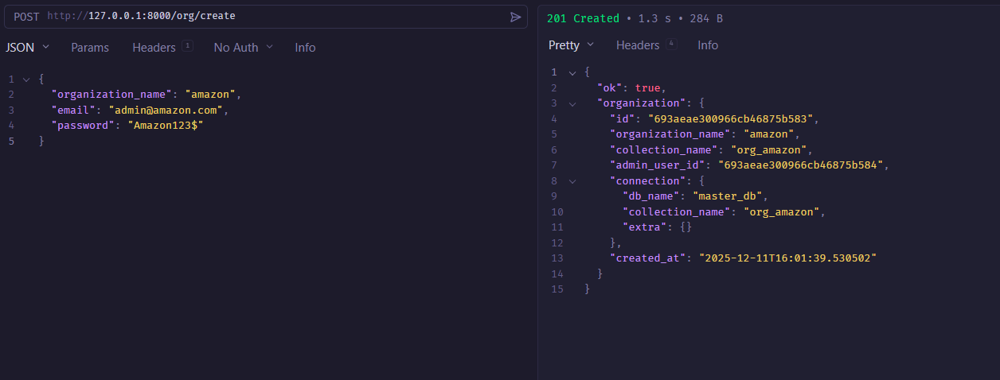
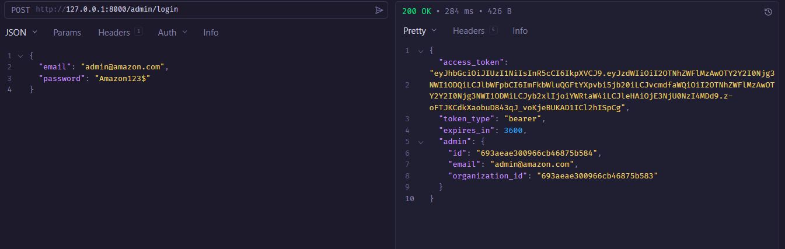
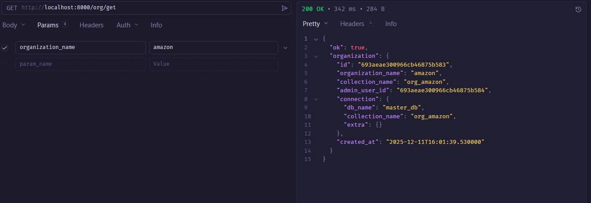
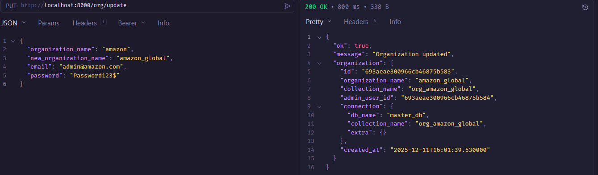
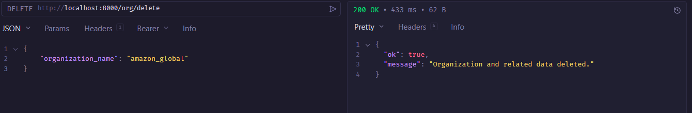

# Multi-Tenant Organization Management Backend

A production-ready Multi-Tenant Backend Service built with **FastAPI** and **MongoDB**. This service manages organizations using a Master Database for metadata and dynamic tenant collections (`<organization_name>`).

## Features

- **Multi-Tenancy**: Dynamic creation of tenant collections per organization.
- **Authentication**: JWT-based Admin authentication with Bcrypt password hashing.
- **Organization Management**: CRUD operations including **renaming organizations** with automatic data migration.
- **Scalable Architecture**: Modular design separating API, Services, Models, and DB layers.

## Tech Stack

- **Framework**: FastAPI (Python 3.11+)
- **Database**: MongoDB (Motor async driver)
- **Validation**: Pydantic v2
- **Auth**: Python-Jose (JWT), Passlib (Bcrypt)

## Setting up MongoDB Atlas

1.  **Create an Account**: Go to [MongoDB Atlas](https://www.mongodb.com/cloud/atlas) and sign up for a free account.
2.  **Deploy a Cluster**:
    - Click **Build a Database**.
    - Select **M0 Free** (Shared) tier.
    - Choose a provider (AWS, Google Cloud, Azure) and region close to you.
    - Click **Create Cluster**.
3.  **Create a Database User**:
    - Go to **Security > Database Access**.
    - Click **Add New Database User**.
    - Choose **Password Authentication**.
    - Enter a username and password (remember these for your `.env`).
    - Grant **Read and write to any database** privileges.
    - Click **Add User**.
4.  **Network Access**:
    - Go to **Security > Network Access**.
    - Click **Add IP Address**.
    - Select **Allow Access from Anywhere** (0.0.0.0/0) for development ease, or add your specific IP.
    - Click **Confirm**.
5.  **Get Connection String**:
    - Go to **Database > Connect**.
    - Select **Drivers**.
    - Choose **Python** and version **3.6 or later**.
    - Copy the connection string. It will look like:
      `mongodb+srv://<username>:<password>@cluster0.abcde.mongodb.net/?retryWrites=true&w=majority`
    - Replace `<username>` and `<password>` with the user you created in step 3.

## Setup & Compatibility


### 1. Environment Variables
Create a `.env` file in the `backend` directory (copy from `.env.example`):

```bash
cp .env.example .env
```

**Required Variables**:
- `MONGO_URI`: Your MongoDB Atlas connection string.
- `JWT_SECRET`: A secure random string for signing tokens.
- `MASTER_DB_NAME`: Default is `master_db`.


### 2. Running Locally

**Install Dependencies**:
```bash
pip install -r requirements.txt
```

**Run Server**:
```bash
uvicorn app.main:app --reload
```

## Testing

Run the integration tests (requires a running MongoDB instance):

```bash
# Make sure MONGO_URI in .env points to a valid instance or use docker-compose
pytest tests/
```

## API Documentation

- **ReDoc**: [http://localhost:8000/redoc](http://localhost:8000/redoc)

## Project Structure

```
backend/
├── app/
│   ├── api/          # Route handlers (auth, orgs)
│   ├── core/         # Config and Security
│   ├── db/           # Database Connection & Repository
│   ├── models/       # Database Models
│   ├── schemas/      # Pydantic Schemas (Request/Response)
│   ├── services/     # Business Logic (OrgService, AuthService, MigrationService)
│   └── main.py       # App Entrypoint
├── tests/            # Integration Tests
├── Dockerfile
├── docker-compose.yml
└── requirements.txt
```

## Test Results & Demo

Here are the results from testing the API endpoints:

### 1. Create Organization
Successfully creating a new organization `amazon` with an admin account.


### 2. Admin Login
Logging in as the admin to receive a secure JWT access token.


### 3. Get Organization
Retrieving organization metadata using the public/protected endpoint.


### 4. Update Organization (Rename)
Renaming `amazon` to `amazon_global`. The system automatically migrates the collection `org_amazon` -> `org_amazon_global`.


### 5. Delete Organization
Deleting the organization, which removes the tenant collection and all associated metadata.


## High Level Flow
